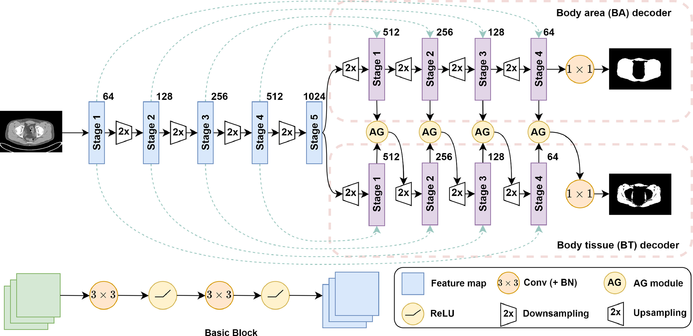

This is the official repository of **GA-Net: A geographical attention neural network for the segmentation of body torso tissue composition**.

GA-Net is a convolution neural network specifically designed for body composition tissue segmentation.

By leveraging relationships between body regions and body tissues, GA-Net explores rich anatomical inclusion relationships between body regions and body tissues to locate and identify body tissues precisely.

## Paper

Dai, Jian, Tiange Liu, Drew A. Torigian, Yubing Tong, Shiwei Han, Pengju Nie, Jing Zhang, Ran Li, Fei Xie, and Jayaram K. Udupa. "GA-Net: A geographical attention neural network for the segmentation of body torso tissue composition." *Medical Image Analysis* 91 (2024): 102987.

[Paper](https://www.sciencedirect.com/science/article/pii/S1361841523002475)

Dai, Jian, Jayaram K. Udupa, Drew A. Torigian, Yubing Tong, Pengju Nie, Jing Zhang, Ran Li, Shiwei Han, and Tiange Liu. "A deep-learning-based geographic attention model for body composition tissue segmentation." In *Medical Imaging 2023: Biomedical Applications in Molecular, Structural, and Functional Imaging*, vol. 12468, pp. 12-18. SPIE, 2023.

[Paper](https://www.spiedigitallibrary.org/conference-proceedings-of-spie/12468/1246804/A-deep-learning-based-geographic-attention-model-for-body-composition/10.1117/12.2653371.short)

## Relationships between body regions and body tissues:


GA-Net is a dual-decoder neural network for segmenting body regions and body tissues by corresponding branch. The semantic information of body regions helps to improve the segmentation performance of body tissues by the attention mechanism.

## Model architecture of GA-Net:



## Prepare training and test materials

1. Split dataset for training, validation, and testing. Get statistics of training set for z-score normalization. Get foreground range of each study for balanced sampling.

```
# This will produce a json file contains data sets for training, validation, and testing, as well as other information about the dataset.
python -u dataset/materials/extract_dataset_properties.py
```

2. Get image slice files for training. Because GA-Net is a 2D network, so we convert 3D format data into 2D slices first.

```
python -u dataset/materials/get_slice_files.py
```

3. Convert IM0 and BIM 3D data to JSON format for validation and testing.

```
python -u dataset/materials/get_volume_data.py
```

## Run training and testing

Set up hyperparameters for training and testing in the config toml file and run the script.

```
python -u train_ganet.py --cfg ./cfgs/training/GA-Net_SAT.toml
```


## Citations

Please cite the following papers if you use GA-Net:

```
@article{dai2024ga,
  title={GA-Net: A geographical attention neural network for the segmentation of body torso tissue composition},
  author={Dai, Jian and Liu, Tiange and Torigian, Drew A and Tong, Yubing and Han, Shiwei and Nie, Pengju and Zhang, Jing and Li, Ran and Xie, Fei and Udupa, Jayaram K},
  journal={Medical Image Analysis},
  volume={91},
  pages={102987},
  year={2024},
  publisher={Elsevier}
}
```

```
@inproceedings{dai2023deep,
  title={A deep-learning-based geographic attention model for body composition tissue segmentation},
  author={Dai, Jian and Udupa, Jayaram K and Torigian, Drew A and Tong, Yubing and Nie, Pengju and Zhang, Jing and Li, Ran and Han, Shiwei and Liu, Tiange},
  booktitle={Medical Imaging 2023: Biomedical Applications in Molecular, Structural, and Functional Imaging},
  volume={12468},
  pages={12--18},
  year={2023},
  organization={SPIE}
}
```

